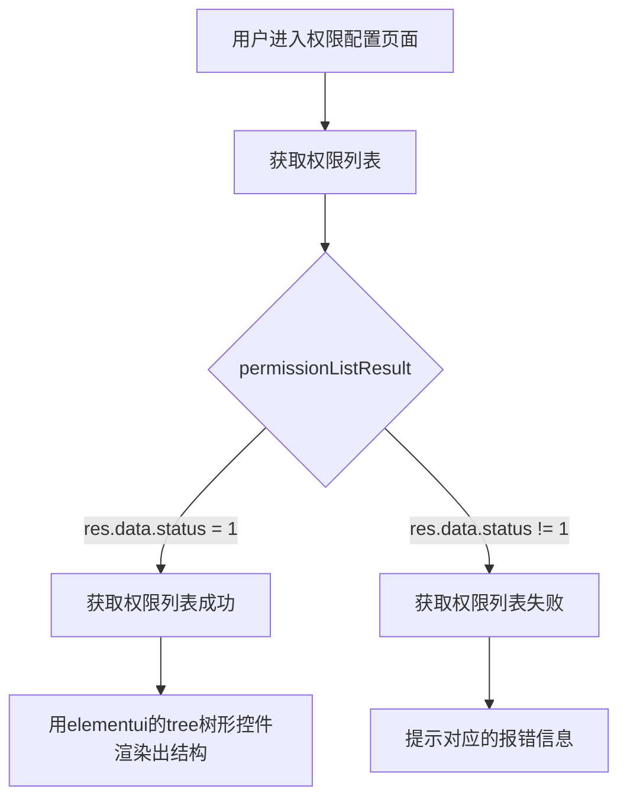
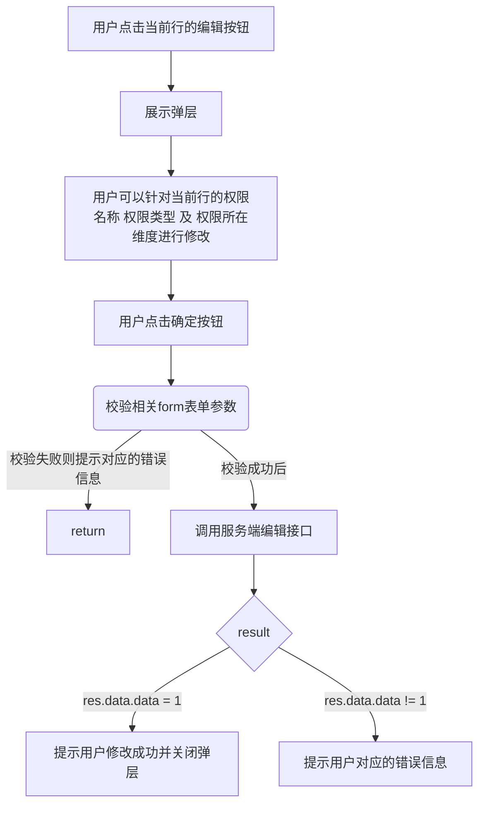
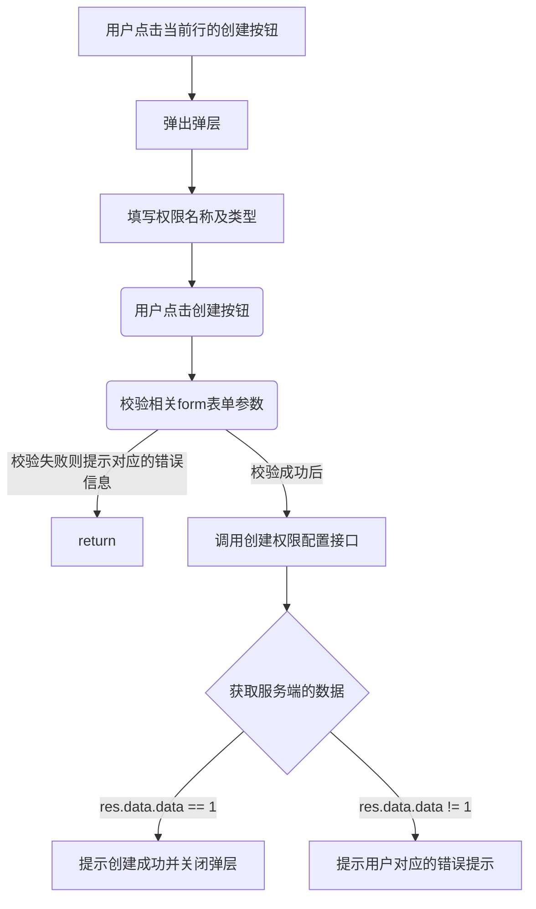

## 权限配置产品文档

### 产品文档
1. 用户进入权限配置页面
2. 渲染出tree形权限控件
3. tree形控件的每一行数据支持增加、删除、和修改;
4. 点击删除按钮，提示是否确认删除当前任务的提示，如果点击确定，则删除当前任务及当前任务下所有子级的任务；
5. 点击新增按钮弹出弹层:支持填写 名称 及权限类型
6. 编辑按钮需要做复显操作；同时比新增的弹层多一个修改当前权限级别的选项; 

### 流程控制图

### 编辑控制图

###  创建逻辑的流程控制图

